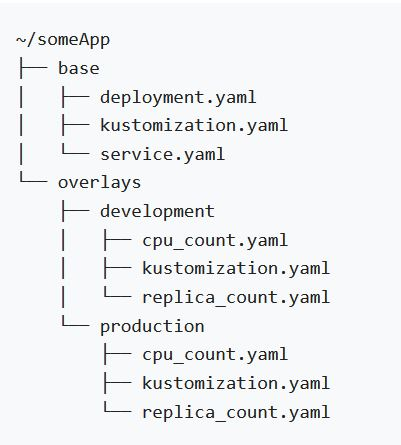

# nodejs-manifest

*******
Tables of contents  
 1. [Jenkins installation ](#JenkinsInstallation )
 2. [Setup 2 pipelines](#Setup2Pipelines)
 3. [Setup Argo CD for deployment](#SetupArgoCDForDeployment)
 4. [Use of Kustomization for multiple environment](#UseOfKustomizationForMultipleEnvironment)

*******

<div id='JenkinsInstallation'/>  

### 1. Jenkins installation 
a. [Install jenkins in EC2](https://www.jenkins.io/doc/tutorials/tutorial-for-installing-jenkins-on-AWS/)

- Install Docker
- Run ```sudo chmod 666 /var/run/docker.sock``` on the EC2 after Docker is installed.
			
b. Install Jenkins plugins
	
- Docker plugin
- Docker Pipeline
- Locale
			
c. Config credentials
	
- github
- dockerhub
	
<div id='Setup2Pipelines'/>  

### 2. Setup 2 pipelines
a. For building image [nodejs-code](https://github.com/johnchan2016/nodejs-code.git)

- Use nodejs for Web server
- Init the project
- Create a Dockerfile for building nodejs image
	```
		FROM node:16-alpine
		ENV APP_ENV=dev

		WORKDIR /app

		COPY ["package.json", "package-lock.json*", "./"]

		RUN npm install

		COPY . .

		CMD [ "node", "app.js" ]
	```
	
- Create a jenkinsfile for the pipeline
	
	- Create a stage for building image			
	- Trigger another pipeline to update k8s manifest
	
	```
	    stage('Trigger ManifestUpdate') {
		echo "triggering updatemanifestjob"
		build job: 'UpdateNodeManifest', parameters: [string(name: 'DOCKERTAG', value: "${IMAGETAG}"), string(name: 'APPENV', value: "${APPENV}")]
	    }
  	```
	
b. for update k8s manifest [nodejs-manifest](https://github.com/johnchan2016/nodejs-manifest.git)

- Update image tag in manifests/overlays/${ENV}/kustomization.yaml
- Commit the changes
	
<div id='SetupArgoCDForDeployment'/>  

### 3. Setup Argo CD for deployment

- Setup a EKS cluster using AWS cloudformation
- [Install Argo CD](https://www.eksworkshop.com/intermediate/290_argocd/)
- [Setup application](https://argo-cd.readthedocs.io/en/stable/getting_started/#6-create-an-application-from-a-git-repository) inside Argo CD for automated deployment 

<div id='UseOfKustomizationForMultipleEnvironment'/>  

### 4. Use of Kustomization for multiple environment

- [Install kustomize](https://kubectl.docs.kubernetes.io/installation/kustomize/)
- [Make kustomization folder structure like below](https://kubectl.docs.kubernetes.io/guides/introduction/kustomize/)<br/>
  
- Corresponding service accounts are required to created if pods deployed with different namespace with prefix, like 'dev', 'uat' using service account
